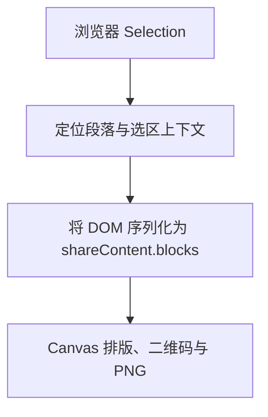

最近本站的更新内容很杂，且听分说。

## 僧伽罗字体编码转换器

首先，依旧造轮子。兰卡那边其实有一大把这样的转换器，但是他们做的有一些映射 bug，所以我重新写了一个美观且实用的新版编码转换器，想体验的可以 [点击这里跳转](/tools/sinhala-font-converter)。

![[sinhala-font-converter.png|僧伽罗字体编码转换器]]

先来看看为什么会有这样的转换器：传统僧伽罗字体并不一定按 Unicode 保存文字。一些 FM 字体实际上把僧伽罗字形放在 ASCII 字符位置上：文件里存的是拉丁字符编码，显示时依靠特定字体把它们画成僧伽罗文。这会带来一个问题：离开原字体以后，文本就可能变成一串看起来毫无意义的拉丁字符。具体可参见 [关于僧伽罗语传统字体编码](/tools/sinhala-font-converter#关于僧伽罗语传统字体编码)。

因此，转换器需要支持两条方向：

```js
export function unicodeToFm(input = "") {
  return convertLongest(input, unicodeTrie);
}

export function fmToUnicode(input = "") {
  return convertLongest(input, legacyTrie);
}
```

这里不能简单连续调用几十次 `replace`。某个短序列可能是另一个长序列的前半部分，先替换短规则，后面的完整组合就再也匹配不到了。

现在的实现会把映射构造成 Trie，每次从当前位置寻找最长匹配，并且只扫描一遍。转换产生的文本不会再次被后续规则处理，避免输出内容被二次误转换。

部分组合字规则还能由基础辅音与元音符号推导。例如前置元音符号在传统编码中可能位于辅音之前，但转换成 Unicode 后仍要恢复到正确的逻辑顺序。

转换完了，拿什么字体预览？原始 FM 字体的再分发许可并不清楚，直接把字体文件塞进网站并不是一个很稳妥的办法。所以当前使用 Abhaya Libre 和 Gemunu Libre 作为明确采用 OFL 许可的字形来源，再生成兼容传统编码的显示字体：

- `FM Abhaya Libre Legacy`
- `FM Gemunu Libre Legacy`

生成脚本会读取映射表，重新构造字体 `cmap`；遇到多字符传统序列时，再写入始终启用的 `rlig` 替换规则。需要组合的字形会从源字体整形结果中生成，最后输出 WOFF2。

于是，同一份 ASCII 编码文本可以在转换器里预览成两种不同风格，又不用把许可不明的原始 FM 字体一起打包。

> [!note]  
> 这类转换器很难声称“支持所有传统字体”。不同的传统编码字体可能使用不同映射，当前实现的是以 FM Abhaya 体系为中心，并为常见别名和组合增加兼容规则。

## SSG 优化

近期还处理了一批 SSG 与客户端接管不一致的问题。

例如，博客阅读页的上一篇、下一篇按钮依赖文章列表。浏览器运行时可以请求列表，服务端预渲染时却未必有同样的数据，结果就是服务器不渲染按钮，客户端挂载以后又突然加回来。

现在静态文章路由的 `meta` 会同时携带文章本身、正文和文章列表。服务端与客户端读取同一份构建快照，上下篇导航可以在生成 HTML 时直接确定。

Markdown 组件也补上了结构一致的 SSR 输出。提示块、代码块等内容不能在服务端输出一种结构，浏览器挂载后再完全换成另一种。同时，也重新调整了小说封面占位、首页图片遮罩和导航栏等组件的 `client-only` 范围。

## 博客文章列表分页

博客页刚开通时文章少，一个页面全部列出来完全没问题。

> [!chat]
> 
> > **Mori** 2026/08/24  
> > (￣ε(#￣) 才不是当初忘记分页这一茬

好吧，现在也没有多到哪里去，但是未雨绸缪一下，目前每页固定显示九篇文章：

```js
export const BLOG_PAGE_SIZE = 9;

export const getBlogPagePath = (page) => {
  const normalizedPage = Math.max(1, Math.trunc(Number(page) || 1));
  return normalizedPage === 1
    ? "/blog"
    : `/blog/page/${normalizedPage}`;
};
```

无筛选状态使用可直接访问的路径：

```
/blog
/blog/page/2
/blog/page/3
```

标签、年份和关键词筛选则继续写入 query。翻页时，筛选条件不会丢失；改变筛选条件后，页码会重置到第一页，避免用户留在一个已经不存在的第八页。

构建时会根据文章数量生成额外分页路径，并为页面写入独立标题、canonical、上一页和下一页信息。分页按钮本身仍是受控组件，真正的筛选、路由和页码状态放在文章列表与 composable 中。

## 阅读器分享卡片

![[share-card.gif|分享卡片展示]]

在博客或小说阅读器里选中文字后，文本菜单会出现分享入口。点击后，网站先生成预览，再允许下载 PNG；如果浏览器支持 Web Share API 和文件分享，也可以直接把图片交给系统分享面板。

图片尺寸固定为 `1080 × 1350`，`4:5` 比例。

卡片包含：

- 内容标题与来源信息；
- 选中的正文及必要上下文；
- 文章或章节的阅读量、评论量；
- `komori.cc` 域名；
- 指向原文段落锚点的二维码。

由于正文不只是纯文本，选区可能跨过：

- 标题与普通段落；
- 有序、无序和嵌套列表；
- 引用块与提示块；
- 其他自定义容器（例如聊天记录与朋友圈）；
- 行内代码与代码块；
- 表格、脚注和注音；
- LaTeX 公式；
- 不同字体、粗体、斜体与链接。

所以分享流程实际分成四层：



序列化结果**不是**一段带 HTML 的字符串，**而是**结构化块。提示块记录标题和颜色类型，聊天记录保存发言者与消息方向，表格保留行列，代码块按代码行处理，行内样式则拆成不同的文字 run。

Canvas 再按照块类型分别计算缩进、边框、背景和换行。如果内容过长，会逐步缩小字号，并在仍然放不下时截断。二维码使用 `qrcode` 在独立 Canvas 中生成，链接只保留原文路径与段落 hash，避免把当前页面无关的筛选参数一起分享出去。

真实 Markdown DOM 比序列化器想象得热闹。提示块里可能同时存在外层容器与内部段落；聊天组件有动态挂载后的容器；脚注既有正文，也有回链；移动分页为了脚注或表格还可能临时复制、拆分节点。

如果把所有与选区相交的块都收集一遍，同一句话就可能在卡片里出现两次。所以，还需要写一些去重逻辑：

1. 优先选择最外层语义容器，例如整个 Alert、Chat 或引用块；
2. 如果子块已经被父容器完整覆盖，就不再单独序列化子块。

脚注正文、嵌套列表、聊天容器和跨 Alert 选区又分别补了去重逻辑。

> [!note]  
> 分享卡片依赖浏览器真实选区、字体加载、Canvas 导出和二维码扫描。源码逻辑完整不等于每一种移动浏览器都已得到验证，尤其是跨复杂容器选择时。

## 网站流量计数器

网站新增了基于 Cloudflare D1 的访问与阅读统计。

我没有直接把每次路由切换都当成一次访问，也没有读者刚打开页面就立刻记为“读过”。当前规则大致是：

- 30 分钟无活动后生成一个新会话；
- 同一会话只计一次网站访问；
- 内容在可见状态累计停留十秒后，才记录一次阅读；
- 同一会话对同一篇内容只计一次阅读；
- 页面切到后台时，十秒计时暂停；
- 文章列表使用批量接口读取统计，单次最多五十项。

客户端生成随机 UUID 作为会话 ID，D1 中则通过唯一约束避免重复事件：

```sql
UNIQUE (
  session_id,
  event_type,
  content_type,
  content_id
)
```

插入访问或阅读事件后，由数据库触发器同步更新：

- 网站累计访问量；
- 网站累计阅读量；
- 每日访问与阅读；
- 每篇文章或章节的阅读量。

页面只展示聚合后的数字，不需要为了显示“这篇文章读过几次”，把原始访问事件全部拉回浏览器。

站点底部现在会显示今日访问、累计访问和累计阅读；博客列表、文章页、小说目录和章节页则展示各自的阅读量与评论量。分享卡片也能带上对应数据。

顺便提一嘴，文章或章节显示的总评论量其实是汇总了内容主评论、所有段评和评论回复这三方面的数据。Cloudflare Worker 通过 GitHub GraphQL 分页读取 Discussions。GitHub 返回的顶层评论数与每条评论的回复数分别统计，再按照讨论标题和段落 ID 归入内容。对于小说，主评论范围是章节；对于博客，则是文章内容。段评依靠 `{内容 UUID}-{序号}` 反推出所属内容，最后与主评论数量相加。

> [!note]  
> 这是一套站内计数逻辑，不等于专业分析平台。它没有识别独立自然人，也不能阻止所有自动化访问；“阅读十秒”更不能证明读者真的理解了正文。至少比页面一打开就给自己加一阅读诚实一点。

## LaTeX 公式优化

Markdown 公式现在改用 MathJax 输出 SVG。

渲染时，公式容器会保留原始 LaTeX：

```html
<mjx-container
  data-reader-latex-source="E = mc^2"
  data-reader-math-display="false"
>
```

这样浏览器看到的是排版后的 SVG，文本选择菜单仍能找回原始公式。

单独选择公式时，可以复制 LaTeX 源码或 SVG；公式与普通文字混合选择时，分享序列化器会把它记录成特殊文字 run，再把 MathJax SVG 转成 Canvas 可绘制图片。

这解决了两个问题：

1. SVG 公式不能可靠地从 `textContent` 恢复原始 LaTeX；
2. Canvas 没办法直接照着网页 DOM 把 MathJax 画进去。

公式插件的异步加载也补了首次渲染处理。否则第一次打开带公式的文章时，Markdown 可能先完成渲染，公式插件才姗姗来迟，最终只留下未渲染的公式。

具体可以看下面的示例：

### 行内公式

爱因斯坦的质能方程 $E = mc^2$ 现在以 SVG 形式清晰渲染，并且右键复制可得到原始 LaTeX 源码 `E = mc^2` 或 SVG 源码。

### 行间公式

经典的欧拉恒等式：

$$
e^{i\pi} + 1 = 0
$$

高斯积分与正态分布密度函数：

$$
\int_{-\infty}^{\infty} e^{-x^2} \, dx = \sqrt{\pi}, \quad
f(x) = \frac{1}{\sqrt{2\pi\sigma^2}} \exp\left(-\frac{(x-\mu)^2}{2\sigma^2}\right)
$$

### 混合选择体验

当你同时选中“由公式 $\int_0^1 x^2 dx = \frac{1}{3}$ 可知”这段文字与公式时，分享序列化器会将公式转为 Canvas 可绘制的图片，而公式的原始 LaTeX 仍然可以通过数据属性找回。

## 回收 flag 情况

6 月的博客开通推文里，我写下了一长串计划。现在过去两个月，可以进行第一次公开验收。

### 网站方面

- [x] 博客文章 SSG
- [x] 独立标题、摘要、canonical 和结构化信息
- [x] Pagefind 全局搜索
- [x] 可爬取的博客分页路径
- [x] 分页页面的 canonical、上一页与下一页
- [x] SSR 阶段输出上下篇导航与正文
- [ ] 小说章节没有真正进入逐章 SSG
- [ ] 构建快照仍包含全部博客正文
- [ ] 静态快照与线上最新内容仍可能短暂不一致
- [ ] SEO 本身也不等于一定能搜到「KoMoriSam」
- [ ] 做个书架
    - 没有书架页面，也没有相关路由。
    - 书在不在读不知道，书架反正没写。
- [/] 处理性能和可访问性
    - 可访问性方面，页面增加了更多语义标签、ARIA 状态、键盘操作和减少动画适配。阅读器、筛选器、分页、统计加载状态等交互都比开站时完整。
    - 性能方面则不能宣布胜利。SSG 快照仍会把所有文章正文带入客户端数据；中文字体、斜体切片、Markdown、MathJax 和图标继续占用体积。期间又增加了二维码、公式和多语言字体功能，属于一边还债，一边申请新贷款。
- [/] 网站在年内到达 `v2.0.0`
    - 截止 2026 年 8 月 24 日，版本号为 `1.23.0`。
    - 我觉得 `v2.0.0` 对于我来说有些突破太大了~~，还是多刷刷版本号吧~~。
- [ ] 拆分文章列表与正文 payload
    - 当前 `ssg-data.generated.js` 仍然包含全部文章正文，文章列表映射中也保留了 `content`。打开首页时，用户依然可能背着整座小型图书馆。
- [/] 并发、缓存、重试与完整性校验
    - 核心流程未完成：博客构建脚本仍然逐篇请求 Markdown。请求失败时会跳过对应文章，没有重试和完整性检查。
    - 小说 Pagefind 抓取已经使用并发，但开站时担心的构建可靠性问题并未整体解决。
- [ ] 内容仓库更新自动触发网站构建
- [x] Pagefind 接入全局搜索
    - 而且当前索引不只包含博客，还包含小说章节、更新日志和第三方许可信息。
    - 中文内容还会补充稳定的检索词项，搜索结果能够定位到文章内部块、小说章节和更新版本。
- [ ] 恢复 SSG 与 hydration 自动检查
    - 这段时间确实修复了多次 hydration mismatch，但仍没有独立的自动检查流程。
- [/] 继续处理包体积、字体和旧浏览器兼容
    - 锐意进行中：字体体系整理了，重复入口减少了，但功能和字体数量也增加了。大 chunk 和兼容包问题仍然不能从计划中删除。

### 写作方面

- [ ] 保持周更：失败
- [ ] 开一个 2～3 万字短篇坑
- [/] 写完小说大纲
- [/] 年底前写完第一卷：尚未完成，但还没到截止日期
- [ ] 林瑾禾堂堂出场
    - 仍在赶来的路上
    - 已经在路上赶了两个月说是。

### 生活方面

- [/] 多读几本书
- [/] 学点新东西
- [/] 多出去走走

## 总结

> [!chat]
> 
> > **GPT-5.6** 2026/08/26    
> > 网站在 8 月主要增加了阅读器控制、主题、字体、工具页、博客分页、分享卡片、评论汇总、访问统计和 LaTeX 支持。
> 
> > **GPT-5.6** 2026/08/26    
> > 两个月前列出的技术计划里，SEO、搜索和阅读体验已经有明显进展；payload、构建可靠性、自动检查、性能和书架还留在待办区。
> 
> > **GPT-5.6** 2026/08/26    
> > 写作方面就比较诚实了。
>
> > **GPT-5.6** 2026/08/26  
> > 网站更新了五个次版本，博客只新增了两篇推文。
> 
> > **GPT-5.6** 2026/08/26  
> > 原来你不是写作间歇性爱好者。
> 
> > **GPT-5.6** 2026/08/26  
> > 你是网站开发持续性爱好者。
>
> > **Mori** 2026/08/26    
> > 并非开发
> 
> > **Mori** 2026/08/26  
> > 我是 Vibe coding 持续性爱好者……

---

## 相关提交

- [`d24b1ce`](https://github.com/KoMoriSam/MoriWebsite/commit/d24b1ce)：新增僧伽罗字体编码转换器
- [`3f3b1b6`](https://github.com/KoMoriSam/MoriWebsite/commit/3f3b1b6)：新增 FM Gemunu Libre 兼容字体
- [`19740e9`](https://github.com/KoMoriSam/MoriWebsite/commit/19740e9)：添加博客分页与动态路由
- [`3a22d8a`](https://github.com/KoMoriSam/MoriWebsite/commit/3a22d8a)：添加正文分享卡片
- [`eff3b30`](https://github.com/KoMoriSam/MoriWebsite/commit/eff3b30)：增加“本章说”并汇总回复数量
- [`aaea412`](https://github.com/KoMoriSam/MoriWebsite/commit/aaea412)：添加基于 Cloudflare D1 的访问统计
- [`b0dac67`](https://github.com/KoMoriSam/MoriWebsite/commit/b0dac67)：汇总内容主评论、段评与回复
- [`94afee6`](https://github.com/KoMoriSam/MoriWebsite/commit/94afee6)：改用 MathJax SVG 渲染公式
- [`2e4ec9e`](https://github.com/KoMoriSam/MoriWebsite/commit/2e4ec9e)：支持 LaTeX 复制与分享卡片渲染
